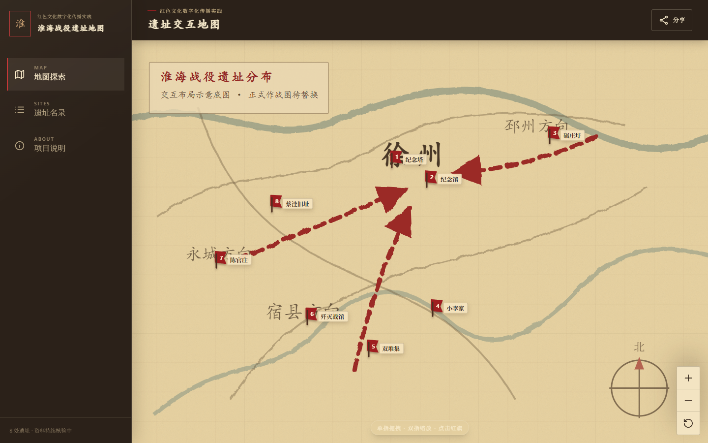
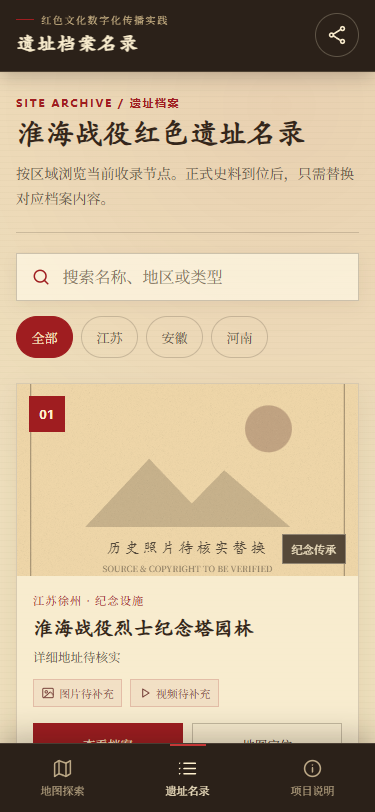
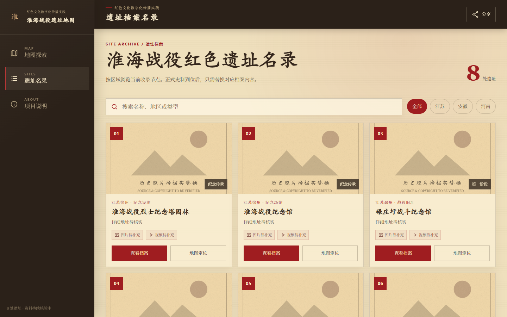

# 淮海战役红色遗址交互地图

> 淮海战役红色文化数字化传播实践成果
> 面向手机、平板和电脑的 H5 红色遗址数字展示平台

项目以“泛黄历史地图 + 红色遗址节点”为核心视觉，通过地图探索、遗址档案和图文资料传播淮海战役红色文化。它是社会实践成果展示平台，不是专业旅游导航或历史数据库。



## 项目状态

页面、交互、多端适配、离线外壳和部署配置均已完成。目前只需补充并核验正式历史资料、图片、视频和作战底图。

| 模块 | 状态 |
|---|---|
| React H5 基础工程 | 已完成 |
| 手机、平板、电脑适配 | 已完成 |
| 8 处遗址节点结构 | 已完成 |
| 地图拖拽、滚轮和双指缩放 | 已完成 |
| 遗址搜索与地区筛选 | 已完成 |
| 遗址图文档案和媒体槽位 | 已完成 |
| B站视频和高德地图跳转 | 已完成 |
| PWA 离线应用外壳 | 已完成 |
| Azure Static Web Apps 配置 | 已完成 |
| 正式作战底图 | 待提供及授权 |
| 权威遗址史料 | 待核实 |
| 历史照片和专题视频 | 待提供 |

完整资料需求见 [资料收集清单](docs/material-checklist.md)。

## 核心功能

- 旧纸档案风格的淮海战役区域地图
- 8 个百分比坐标遗址节点
- 单指拖拽、双指缩放、鼠标滚轮缩放和重置
- 点击节点自动聚焦并打开遗址档案
- 遗址名称、地区和类型搜索
- 江苏、安徽、河南地区筛选
- 封面、历史正文、图集、来源和视频内容槽位
- B站或权威平台视频外链
- 高德地图地点检索
- 手机底部导航、平板网格、桌面档案侧栏
- Web App Manifest、Service Worker 和离线应用外壳

## 多端展示

| 手机端 | 桌面端 |
|---|---|
|  |  |

已自动验证以下代表视口：

- 320 × 700
- 375 × 812
- 768 × 1024
- 1024 × 768
- 1440 × 900
- 812 × 375 横屏

上述视口均无页面级水平溢出。详细结果见 [QA 报告](docs/qa-report.md)。

## 技术栈

- React 18
- Vite 8
- TypeScript
- Tailwind CSS
- react-zoom-pan-pinch
- PWA Service Worker
- Azure Static Web Apps

项目为纯静态前端，不使用数据库、后台、用户系统或权限系统。

## 本地运行

环境要求：Node.js 20.19 或更高版本。

```bash
npm install
npm run dev
```

生产构建：

```bash
npm run build
```

预览生产包：

```bash
npm run preview
```

检查遗址数据结构：

```bash
npm run validate:content
```

资料全部补齐后的严格检查：

```bash
npm run validate:content -- --strict
```

## 项目结构

```text
HuaiHai-h5-map/
├── public/
│   ├── archive-map-placeholder.svg  # 待替换的地图底图
│   ├── site-placeholder.svg         # 待替换的遗址封面
│   ├── manifest.webmanifest
│   ├── sw.js
│   └── staticwebapp.config.json     # Azure 静态站点配置
├── src/
│   ├── components/                  # 导航、地图、名录、详情等组件
│   ├── data/sites.json              # 遗址数据唯一入口
│   ├── styles/                      # 设计令牌和全局样式
│   └── types/
├── docs/
│   ├── material-checklist.md        # 资料收集清单
│   ├── content-guide.md             # 内容替换说明
│   ├── qa-report.md                 # 多端验收结果
│   └── qa/                          # 多端截图
├── scripts/validate-content.mjs
└── design-system/MASTER.md
```

## 内容维护

遗址数据集中保存在 [`src/data/sites.json`](src/data/sites.json)。其中：

- `x`、`y` 是相对于底图的百分比坐标，不是经纬度。
- `history` 用于正式历史正文。
- `gallery` 用于历史照片和现场照片。
- `videoUrl` 用于专题视频链接。
- `sources` 用于权威资料来源。
- `contentStatus` 控制页面上的资料准备状态。

拿到正式资料后的替换步骤见 [内容替换指南](docs/content-guide.md)。

## 部署

### Azure Static Web Apps

推荐配置：

| 配置项 | 值 |
|---|---|
| App location | `/` |
| API location | 留空 |
| Output location | `dist` |
| Build command | `npm run build` |

仓库已提供 `public/staticwebapp.config.json`，构建时会自动复制到 `dist/`。

### 其他静态托管

运行 `npm run build` 后，将 `dist/` 目录上传至任意静态网站服务即可。服务器需要将未知前端路径回退到 `index.html`。

## 史料与版权原则

- 不编造遗址名称、战役经过、人物、日期和伤亡数据。
- 历史资料应优先采用纪念馆、政府、党史部门和正式出版物。
- 所有图片应记录来源、作者或收藏单位、版权状态和图注。
- 正式作战图必须确认公开使用或取得授权。
- 视频不在本站自托管，优先使用权威平台或 B站链接。

## 相关文档

- [资料收集清单](docs/material-checklist.md)
- [内容替换指南](docs/content-guide.md)
- [完整 QA 报告](docs/qa-report.md)
- [设计系统](design-system/MASTER.md)
- [需求卡片](docs/requirements-card.md)

## 设计与实现说明

前端设计采用 Dog-Frontier 工作流，参考其 `frontend-design` 设计哲学、设计令牌方法与 QA 检查标准。
