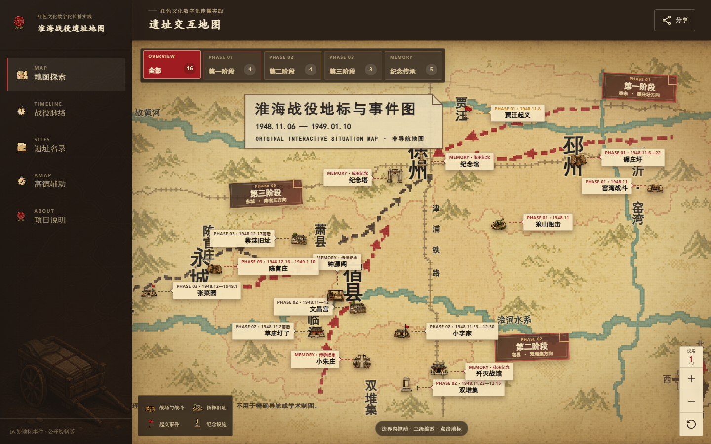
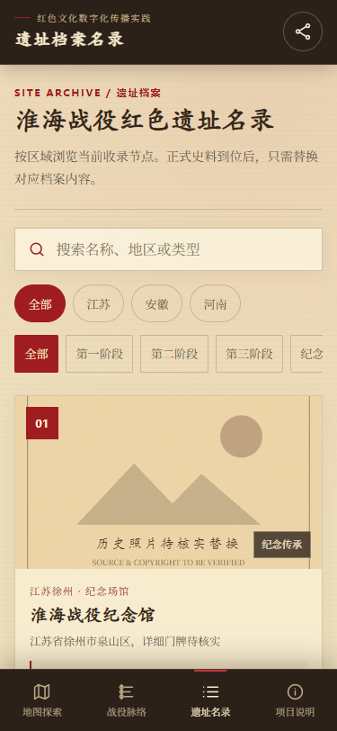
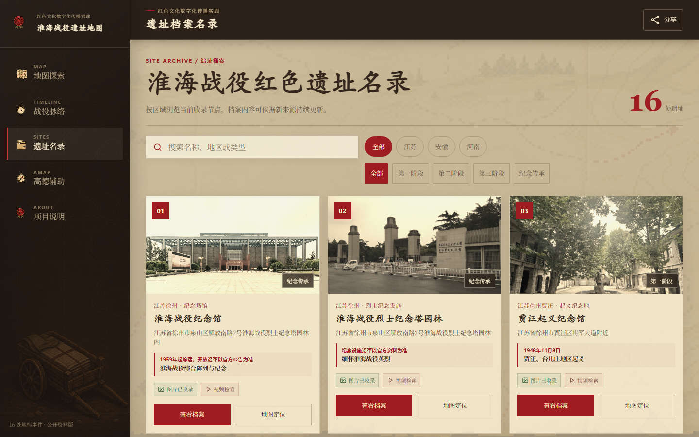

# 淮海战役红色遗址交互地图

<p align="center">
  <a href="https://huaihai.zylatent.com">
    
  </a>
  
  
  
  
  
  
</p>

<p align="center">
  
  
  <a href="https://github.com/ZhouYinLong-lab/HuaiHai-h5-map/actions/workflows/deploy.yml">
    
  </a>
  
</p>

> 淮海战役红色文化数字化传播实践成果
> 面向手机、平板和电脑的 H5 红色遗址数字展示平台


项目以"泛黄历史地图 + 红色地标事件"为核心视觉，通过地图探索、战役时间线、遗址档案和图文资料传播淮海战役红色文化。它是社会实践成果展示平台，不是专业旅游导航或历史数据库。



## 项目状态

页面、交互、多端适配、档案地图开场动画、像素风 UI 资源、离线外壳和部署配置均已完成。当前已补充 16 处节点的公网来源、主要地址和基础史实；正式上线前仍需补充授权图片、逐站视频、精确高德定位和正式底图授权。

| 模块 | 状态 |
|---|---|
| React H5 基础工程 | 已完成 |
| 手机、平板、电脑适配 | 已完成 |
| 16 处地标事件结构 | 已完成 |
| 三阶段战役时间线 | 已完成 |
| 地图拖拽、滚轮和双指缩放 | 已完成 |
| 遗址搜索与地区筛选 | 已完成 |
| 遗址图文档案和媒体槽位 | 已完成 |
| 卷轴式红色文化开场动画 | 已完成 |
| B站视频和高德地图 URI 跳转 | 已完成 |
| 高德开放平台 JS API 页面 | 已接入，部署时预置 Key |
| PWA 离线应用外壳 | 已完成 |
| Azure Static Web Apps 配置 | 已完成 |
| 原创战役态势底图 | 已完成 |
| 河流、山地、区域边界与作战箭头像素化 | 已完成 |
| 像素风导航图标、全站档案背景、导航推车背景、地图节点图集与 favicon | 已完成，资源位于 `public/media/pixel/` 与 `public/favicon-pixel.png` |
| 公网权威来源链接 | 已补充 |
| 权威遗址史料细节 | 11/16 已核实 |
| 中期审查媒体资源 | 6/16 已补公开资料照片 |
| 正式历史照片和专题视频 | 待提供 |

完整资料需求见 [资料收集清单](docs/material-checklist.md)，中期图片说明见 [中期审查媒体资源说明](docs/midterm-media-pack.md)，必须实地采集或授权确认的内容见 [实地资料需求表](docs/on-site-materials.md)。

## 核心功能

- 旧纸档案风格的淮海战役区域地图
- 首次进入的卷轴打开式红色文化开场动画
- 三阶段战役时间线与关键事件叙事
- 16 个地标事件节点，覆盖战场、指挥旧址、起义事件和纪念设施
- 第一、第二、第三阶段及纪念传承筛选
- 单指拖拽、双指缩放、鼠标滚轮缩放和重置
- 点击节点自动聚焦并打开遗址档案
- 遗址名称、地区和类型搜索
- 江苏、安徽、河南地区筛选
- 封面、历史正文、图集、来源和视频内容槽位
- B站或权威平台视频外链
- 高德地图地点检索
- 高德开放平台 JS API 辅助页，部署方预置 Key 后访问者可直接使用
- 手机底部导航、平板网格、桌面档案侧栏
- Web App Manifest、Service Worker 和离线应用外壳

## 多端展示

| 手机端 | 桌面端 |
|---|---|
|  |  |

已自动验证以下代表视口：

- 320 × 700
- 375 × 812
- 768 × 1024
- 1024 × 768
- 1440 × 900
- 812 × 375 横屏

上述视口均无页面级水平溢出。详细结果见 [QA 报告](docs/qa-report.md)。

## 技术栈

- React 18
- Vite 8
- TypeScript
- Tailwind CSS
- react-zoom-pan-pinch
- 高德开放平台 JS API 2.0，可选增强
- PWA Service Worker
- Azure Static Web Apps

项目为纯静态前端，不使用数据库、后台、用户系统或权限系统。

## 本地部署与预览

### 环境要求

- Node.js 20.19 或更高版本
- npm 10 或更高版本

确认环境：

```bash
node --version
npm --version
```

### 1. 安装依赖

在项目根目录执行：

```bash
npm install
```

### 2. 配置高德开放平台 Key

高德地图分两种能力：

- 高德 URI 跳转：不需要 Key，点击后跳转到高德地图检索。
- 页面内嵌高德 JS 地图：需要高德开放平台 Web 端 JSAPI Key。

Key 只需要开发者或部署方配置一次，访问网站的普通用户不需要填写。项目默认不提交真实 Key；本地开发时复制 `.env.example` 为 `.env.local`：

```bash
cp .env.example .env.local
```

然后填写：

```env
VITE_AMAP_KEY=你的高德Web端JSAPI Key
VITE_AMAP_SECURITY_JS_CODE=你的安全密钥，可按高德控制台要求填写
```

填写后重启开发服务器：

```bash
npm run dev
```

生产部署时，也应在构建环境中配置同名变量。这样打包后的网页会自动带上高德配置，用户打开页面即可直接使用内嵌高德地图。

> 注意：Web 端 JSAPI Key 会出现在前端页面里，这是浏览器地图服务的正常工作方式。请在高德控制台设置 Web 端域名白名单，避免 Key 被其他网站滥用。

### 3. 电脑本地开发预览

```bash
npm run dev
```

终端显示类似以下地址后，在浏览器打开：

```text
http://localhost:5173/
```

开发服务器支持热更新，修改代码后页面会自动刷新。

### 4. 手机或其他设备局域网预览

电脑和手机需要连接同一个 Wi‑Fi，然后执行：

```bash
npm run dev -- --host 0.0.0.0
```

终端会显示 `Network` 地址，例如：

```text
http://192.168.1.100:5173/
```

在手机浏览器输入该地址即可查看。也可以用 PowerShell 查询电脑局域网 IP：

```powershell
Get-NetIPAddress -AddressFamily IPv4 |
  Where-Object { $_.IPAddress -notlike "127.*" } |
  Select-Object InterfaceAlias, IPAddress
```

如果手机无法访问：

1. 确认手机和电脑位于同一局域网；
2. 确认使用的是 WLAN 地址，不是 `127.0.0.1`；
3. 允许 Node.js 通过 Windows 防火墙；
4. 检查路由器是否开启了设备隔离；
5. 确认端口 `5173` 未被其他程序占用。

### 5. 生产构建

```bash
npm run validate:content
npm run build
```

构建结果输出至 `dist/`。生产包包含：

- 压缩后的 HTML、CSS 和 JavaScript
- 原创 SVG 地图
- Web App Manifest
- Service Worker 离线外壳
- Azure Static Web Apps 配置

### 6. 本地预览生产包

```bash
npm run preview -- --host 0.0.0.0
```

电脑浏览器访问：

```text
http://localhost:4173/
```

手机访问终端显示的 `Network` 地址，例如：

```text
http://192.168.1.100:4173/
```

开发预览和生产预览的区别：

| 命令 | 用途 | 默认端口 |
|---|---|---:|
| `npm run dev` | 日常开发、热更新 | 5173 |
| `npm run preview` | 验证最终 `dist/` 构建结果 | 4173 |

停止本地服务器时，在运行服务器的终端按 `Ctrl + C`。

检查遗址数据结构：

```bash
npm run validate:content
```

资料全部补齐后的严格检查：

```bash
npm run validate:content -- --strict
```

## 项目结构

```text
HuaiHai-h5-map/
├── public/
│   ├── archive-map.svg              # 原创战役态势底图
│   ├── favicon-pixel.png            # 像素风 PWA / 浏览器图标
│   ├── site-placeholder.svg         # 待替换的遗址封面
│   ├── manifest.webmanifest
│   ├── media/                        # 中期审查媒体资源与后续正式图片
│   │   └── pixel/                    # 像素风图标、地图节点图集与档案背景
│   ├── sw.js
│   └── staticwebapp.config.json     # Azure 静态站点配置
├── src/
│   ├── components/                  # 导航、地图、时间线、名录、详情等组件
│   ├── data/sites.json              # 遗址数据唯一入口
│   ├── styles/                      # 设计令牌和全局样式
│   └── types/
├── docs/
│   ├── material-checklist.md        # 资料收集清单
│   ├── content-guide.md             # 内容替换说明
│   ├── qa-report.md                 # 多端验收结果
│   └── qa/                          # 多端截图
├── scripts/validate-content.mjs
└── design-system/MASTER.md
```

## 内容维护

遗址数据集中保存在 [`src/data/sites.json`](src/data/sites.json)。其中：

- `x`、`y` 是相对于底图的百分比坐标，不是经纬度。
- `history` 用于正式历史正文。
- `gallery` 用于历史照片和现场照片。
- `videoUrl` 用于专题视频链接。
- `sources` 用于权威资料来源。
- `contentStatus` 控制页面上的资料准备状态。

拿到正式资料后的替换步骤见 [内容替换指南](docs/content-guide.md)。

## 相关文档

- [资料收集清单](docs/material-checklist.md)
- [中期审查媒体资源说明](docs/midterm-media-pack.md)
- [实地资料需求表](docs/on-site-materials.md)
- [地标事件调研与来源说明](docs/research-sources.md)
- [内容替换指南](docs/content-guide.md)
- [完整 QA 报告](docs/qa-report.md)
- [设计系统](design-system/MASTER.md)
- [需求卡片](docs/requirements-card.md)

## 设计与实现说明

前端设计采用 Dog-Frontier 工作流，参考其 `frontend-design` 设计哲学、设计令牌方法与 QA 检查标准。
