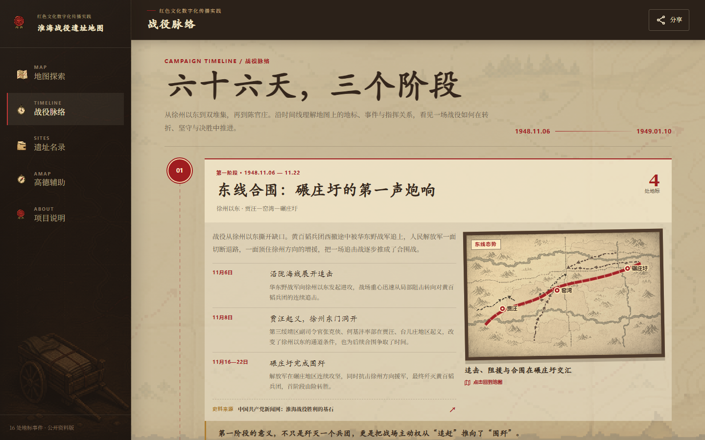
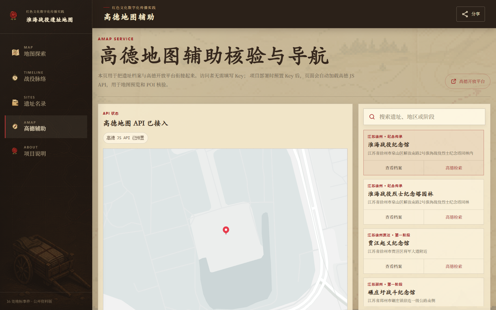
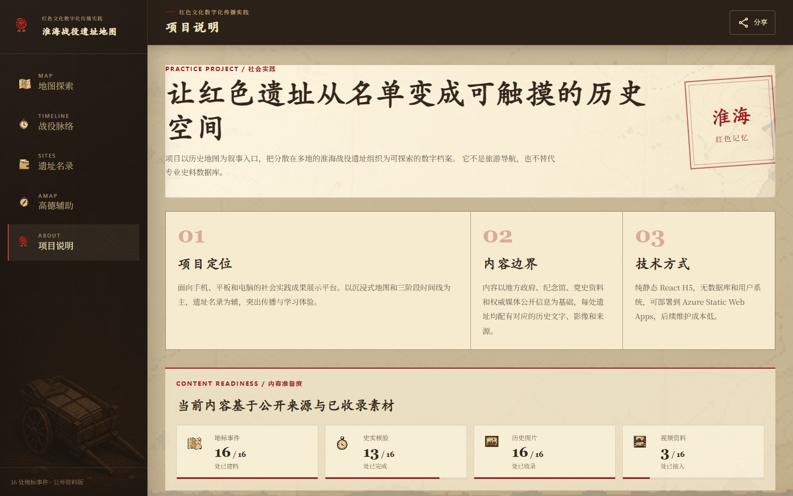

# 淮海战役红色遗址交互地图

<p align="center">
  
  
  
</p>

> 南京大学社会实践项目数字化展示成果
> 淮海战役红色文化传播 H5 红色遗址交互地图

本项目是南京大学社会实践项目的数字化展示成果，以“泛黄历史地图＋红色地标事件”为核心视觉，通过地图探索、战役脉络、遗址档案和图文资料，讲述淮海战役相关遗址与地方红色记忆。

项目定位为社会实践成果展示平台，不是专业旅游导航、精确地图或历史数据库。

<p align="center">
  
</p>

## 当前内容

- 收录 16 处淮海战役相关地标事件。
- 覆盖第一阶段、第二阶段、第三阶段和纪念传承四类内容。
- 战役脉络按“东线合围—双堆集攻坚—陈官庄决胜—纪念传承”展开。
- 各阶段包含关键时间节点、战局转折、官方来源和可返回地图的像素态势卡片。
- 遗址档案包含历史正文、图片、图集、资料来源、视频入口和地图定位。

## 核心功能

- 泛黄档案风格的淮海战役区域地图。
- 像素风河流、山地、区域边界、路线箭头、地图节点和导航图标。
- 地图边界内拖拽、双指缩放、滚轮缩放和视角重置。
- 地图节点点击、自动聚焦和遗址档案侧栏。
- 遗址名称、地区、类型搜索与筛选。
- 战役脉络时间线和关键事件叙事。
- 遗址名录、分类卡片和详情档案。
- 高德地图 URI 检索与导航跳转。
- 高德地图辅助核验页面，用户无需填写 Key。
- B 站或其他权威平台视频外链。
- 手机底部导航、平板网格布局和桌面档案侧栏。
- PWA Manifest、Service Worker 和离线应用外壳。

## 页面展示

### 地图探索

交互式历史地图承载遗址节点、阶段筛选、战役路线和像素化地图图层，是项目的主要入口。

<p align="center">
  
</p>

### 战役脉络

项目的核心叙事页面。通过阶段时间线、关键转折、官方来源和态势地图卡片，呈现淮海战役从东线合围到决胜陈官庄的推进过程，并以纪念传承作为收束。

<p align="center">
  
</p>

### 遗址名录

集中展示 16 处地标事件，支持按名称、地区、类型和战役阶段筛选，并可进入遗址档案或返回地图定位。

<p align="center">
  
</p>

### 高德辅助

将遗址档案与高德地图位置检索连接起来，用于地点核验、地图预览和第三方导航跳转。

<p align="center">
  
</p>

### 项目说明

说明项目的社会实践背景、内容边界、视觉设计和数字化传播方式。

<p align="center">
  
</p>

## 技术栈

- React 18
- Vite 8
- TypeScript
- Tailwind CSS
- react-zoom-pan-pinch
- 高德开放平台 JS API
- PWA Service Worker

项目为纯静态前端，不使用数据库、后台、用户系统或权限系统。

## 项目结构

```text
HuaiHai-h5-map/
├── public/
│   ├── archive-map.svg              # 历史地图与像素装饰图层
│   ├── favicon-pixel.png            # 像素风浏览器图标
│   ├── manifest.webmanifest         # PWA 配置
│   ├── media/                       # 页面背景、地图和遗址媒体资源
│   │   └── pixel/                   # 像素图标、节点图集与地图底稿
│   └── sw.js                        # 离线缓存脚本
├── src/
│   ├── components/                  # 导航、地图、时间线、名录和详情组件
│   ├── data/sites.json              # 遗址数据唯一入口
│   ├── styles/                      # 全局样式与设计令牌
│   └── types/                       # TypeScript 类型定义
├── docs/qa/                         # 多端页面截图
├── scripts/validate-content.mjs     # 内容结构校验
├── design-system/MASTER.md          # 视觉设计系统
└── package.json
```

## 数据维护

遗址数据统一保存在 [`src/data/sites.json`](src/data/sites.json) 中：

- `x`、`y` 是相对于底图的百分比坐标，不是经纬度。
- `history` 是遗址档案中的历史正文。
- `gallery` 保存遗址图片及图片说明。
- `videoUrl` 保存专题视频链接。
- `sources` 保存资料来源链接。
- `stage`、`kind` 用于阶段筛选和地图图例。

## 版权所有（All Rights Reserved）

本项目的源代码、界面设计、原创地图、像素资源、文案组织、项目名称及整体视觉方案，版权归项目作者及南京大学社会实践项目成果所有。除页面中明确标注的第三方资料、历史图片和外部链接外，未经书面许可，不得复制、修改、再发布、商业使用或用于其他项目。

页面中的历史资料、图片和外部平台内容，其权利归原作者或原权利人所有；相关内容仅用于社会实践成果展示与红色文化传播。
